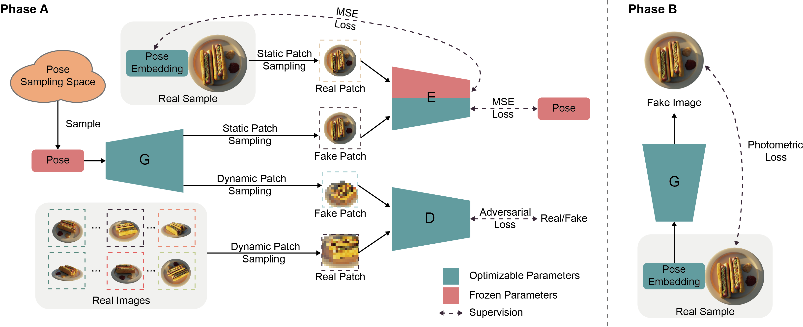
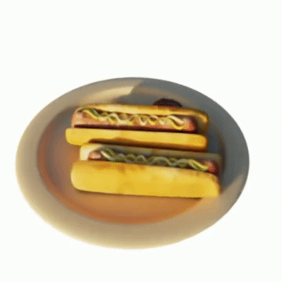
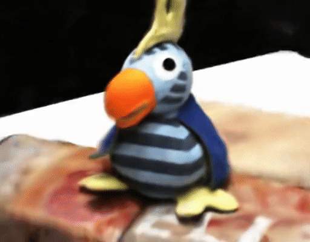

# GNeRF

This repository contains official code for the ICCV 2021 paper:
[GNeRF: GAN-based Neural Radiance Field without Posed Camera](https://arxiv.org/abs/2103.15606). This implementation is
written in [Pytorch](https://pytorch.org/).



## Abstract

We introduce GNeRF, a framework to marry Generative Adversarial Networks (GAN) with Neural Radiance Field (NeRF) 
reconstruction for the complex scenarios with unknown and even randomly initialized camera poses. Recent NeRF-based
advances have gained popularity for remarkable realistic novel view synthesis. However, most of them heavily rely on
accurate camera poses estimation, while few recent methods can only optimize the unknown camera poses in roughly
forward-facing scenes with relatively short camera trajectories and require rough camera poses initialization.
Differently, our GNeRF only utilizes randomly initialized poses for complex outside-in scenarios. We propose a novel
two-phases end-to-end framework. The first phase takes the use of GANs into the new realm for optimizing coarse camera
poses and radiance fields jointly, while the second phase refines them with additional photometric loss. We overcome
local minima using a hybrid and iterative optimization scheme. Extensive experiments on a variety of synthetic and
natural scenes demonstrate the effectiveness of GNeRF. More impressively, our approach outperforms the baselines
favorably in those scenes with repeated patterns or even low textures that are regarded as extremely challenging before.

## Installation

We recommand using [Anaconda](https://www.anaconda.com/) to setup the environment. Run the following commands:

```
# Create a conda environment named 'gnerf'
conda create --name gnerf python=3.7
# Activate the environment
conda activate gnerf
# Install requirements
pip install -r requirements.txt
```

## Data

### Blender

Download from the [NeRF official Google Drive](https://drive.google.com/drive/folders/128yBriW1IG_3NJ5Rp7APSTZsJqdJdfc1)
. Please download and unzip `nerf_synthetic.zip`.

### DTU

Download the preprocessed [DTU training data](https://drive.google.com/file/d/1eDjh-_bxKKnEuz5h-HXS7EDJn59clx6V/view)
from original [MVSNet repo](https://github.com/YoYo000/MVSNet) and unzip. We also provide a few
[DTU examples](https://drive.google.com/file/d/1vh80KO-EvrUrXuBxzgKJf5Z5hPfPl4Bl/view?usp=sharing) for fast testing.

### Your own data

We share some advices on preparing your own dataset and setting related parameters:

- Pose sampling space should be close to the data: Our method requires a reasonable prior pose distribution.
- The training may fail to converge on symmetrical scenes: The inversion network can not map an image to different poses.

## Running

```
python train.py ./config/CONFIG.yaml --data_dir PATH/TO/DATASET
```

where you replace CONFIG.yaml with your config file (blender.yaml for blender dataset and dtu.yaml for DTU dataset). You
can optionally monitor on the training process using tensorboard by adding `--open_tensorboard` argument. The default
setting takes around 13GB GPU memory. After 40k iterations, you should get a video like these:



## Evaluation

```
python eval.py --ckpt PATH/TO/CKPT.pt --gt PATH/TO/GT.json 
```

where you replace PATH/TO/CKPT.pt with your trained model checkpoint, and PATH/TO/GT.json with the json file in NeRF-Synthetic
dataset. Then, just run the  [ATE toolbox](https://github.com/uzh-rpg/rpg_trajectory_evaluation) on the `evaluation` directory.

## List of Possible Improvements

For future work, we recommend the following aspects to further improve the performance and stability:

- **Replace the single NeRF network with [mip-NeRF](https://jonbarron.info/mipnerf/) network**: The use of separate MLPs
  in the original NeRF paper is a key detail to represent thin objects in the scene, if you retrain the original NeRF
  with only one MLP you will find a decrease in performance. While in our work, a single MLP network is necessary to
  keep the coarse image and fine image aligned. The cone casting and IPE features of mip-NeRF allow it to explicitly
  encode scale into the input features and thereby enable an MLP to learn a multiscale representation of the scene.

- **Combine [BARF](https://arxiv.org/abs/2104.06405) to further overcome local minima**: The BARF method shows that
  susceptibility to noise from positional encoding affects the basin of attraction for registration and present a
  coarse-to-fine registration strategy.

- **Combine [NeRF++](https://arxiv.org/abs/2010.07492) to represent the background in real scenes with complex
  background**.

## Citation

If you find our code or paper useful, please consider citing

    @InProceedings{meng2021gnerf,
        author = {Meng, Quan and Chen, Anpei and Luo, Haimin and Wu, Minye and Su, Hao and Xu, Lan and He, Xuming and Yu, Jingyi},
        title = {{G}{N}e{R}{F}: {G}{A}{N}-based {N}eural {R}adiance {F}ield without {P}osed {C}amera},
        booktitle = {Proceedings of the IEEE/CVF International Conference on Computer Vision (ICCV)},
        year = {2021}
    }

Some code snippets are borrowed from [GRAF](https://github.com/autonomousvision/graf)
and [nerf_pl](https://github.com/kwea123/nerf_pl.git). Thanks for these great projects.